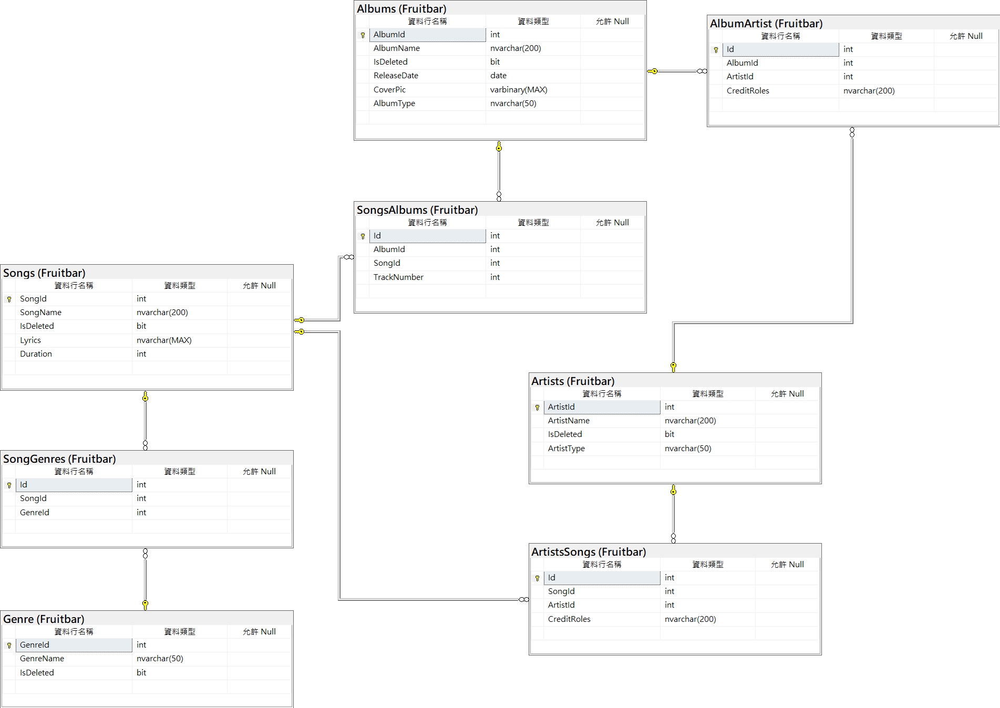

# FruitBar8000 音樂查詢儀表板
- 命名: 期許成為下一個 Foobar2000
- 今天範疇: 資料表基礎設計、基礎關鍵 Metadata 的增刪查改

## 功能特色
- 支援多對多關聯式資料表 (見 [下圖](#資料表關聯圖))
- 支援「軟刪除」，以維資料安全
- 類「三層式架構維護」：
    1. 資料層: 
        - 因應業務需求（一張專輯有很多歌曲，一首曲子有很多創作者），實作「一對多」關聯表　(見 [下圖](#資料表關聯圖))，提升「業務邏輯層」功能擴充彈性。
        - 使用「資料庫程式開發」課程教授之觀念，統一由 EDMX (EntityFramework 6.x) 維護, 實現物件化資料管理, 系統運行時沒事(沒特殊需求)不要手刻 SQL.
        - 現階段採「DB First」，權衡可維護性與初始化效率，利用「SQL」課程教授之小撇步，使用 SSMS 的「資料表設計工具」規劃關聯雛形。
        - 規劃結果除同步到資料庫、EDMX，亦將資料表規格/關聯屬性匯出到 `dbscripts/` 底下的 `.sql` 腳本。使之可遷移。
    2. 業務邏輯層: 
        - 使用「元件開發」課程教授之觀念，抽出「增」(Create)、「查」(Read)、「改」(Update)、「刪」(Delete)等邏輯，適當抽取與 UI 無關的操作，增加可維護性，期許降低抽一根積木就全倒的風險。
        - 使用「資料庫程式開發」課程教授之觀念，善用 ORM 特性，結合 IDE（Visual Studio）特性，利用導引屬性讓物件關聯在編輯器上按「.」即可查找推敲。
    3. UI層: 以 WinForm 實作, 利用基本事件、委派觀念將互動邏輯精簡化、可擴充化。
- 歌曲查詢：將不同欄位類型（歌曲、專輯、創作者）的查詢功能，利用 delegate，把「方法」(Method) 當作參數，有效減少過度重複之程式碼。

## 後續可擴充功能
- 於 Songs 增加欄位，使使用者查詢到後即可透過該欄位的資訊開啟對應媒體/串流平台資訊。
- Albums 已預留欄位增加專輯封面，後續即可透過介面層呼叫、更新專輯封面
- 搜尋可合法使用之音樂 metadata 資訊的平台，建立資料匯入流程，就資料面提升可用/實用性。
- 抽取底層元件、業務邏輯與資料庫架構，開發 Web 服務，預計以 API 服務為主。

## 資料表關聯圖

- 圖片在專案中的路徑: `dbscript/diagram0713-02.png`